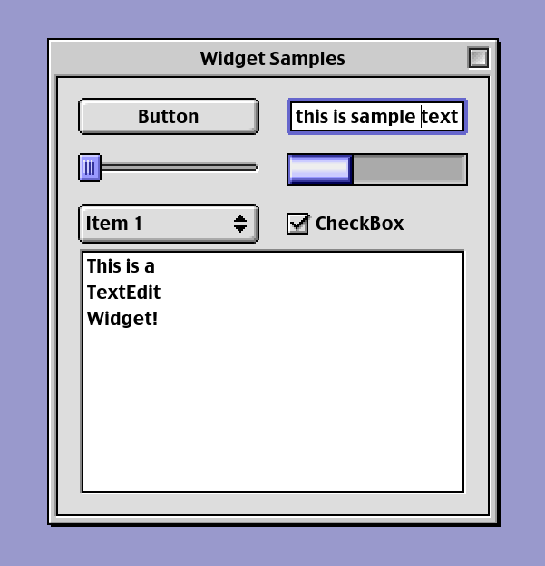

# godot-platinum

A Mac OS 9 inspired theme for Godot

## How to Use

Copy the os9 folder to your project and set os9.tres as your main theme

## Implemented widgets

- Button
- CheckBox
- CheckButton
- ScrollBar
- Slider
- Label
- OptionButton
- PopupPanel
- ProgressBar
- SpinBox
- TextEdit
- Tree
- Window

## Known Bugs

- Tabs are not implemented yet
- Scrollbars in TextEdit are misaligned
- Window disappears when selecting an OptionButton